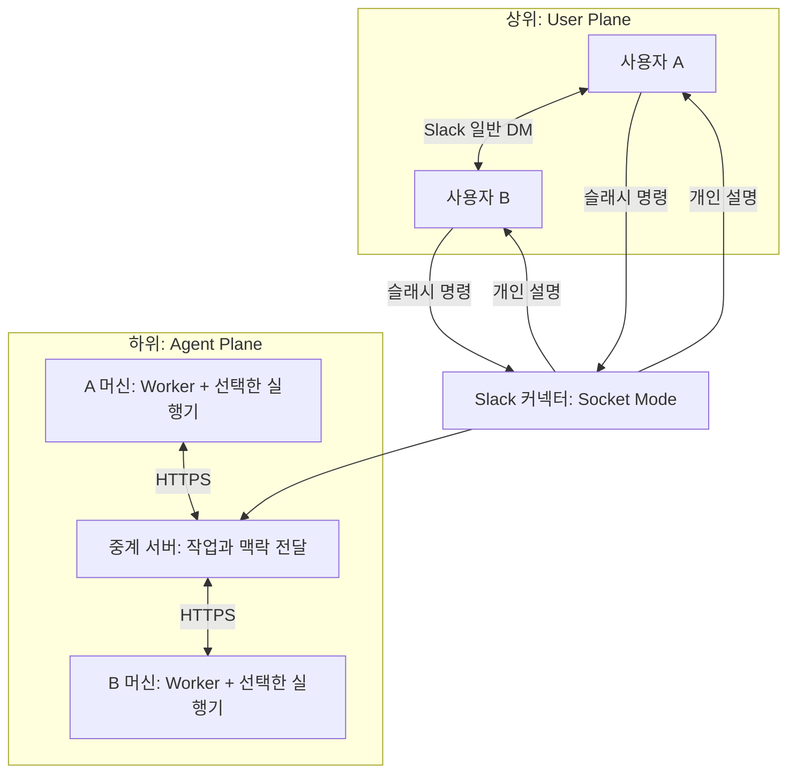

# Tacit Agent Plane

목표 설계와 개발 범위는 [개발 SSOT](docs/DEVELOPMENT_SSOT.md)를 따른다. Slack Home, 자율 자료 검색, 공유 승인, Agent 추가 대화의 구현·업데이트 절차는 [v2 운영 안내](docs/WORKFLOW_V2.md)에 있다.

첫 마일스톤: 사용자 A과 사용자 B이 실제 Slack DM을 주고받을 때 각자의 머신에서 실행되는 Agent가 로컬 맥락을 찾아 교환하고, 수신자에게 맞춘 설명을 표시한다.

**v2 기능 코드는 구현되었고 운영 배포는 별도다.** 2026-09-21 확인한 운영 서버는 아직 protocol 1이다. 과거 두 머신 연결과 A → B 처리·알림, B Kiro 실제 맥락 생성은 확인했다. 새 승인 UI·Agent 왕복의 실제 검증은 중앙·Slack 권한·워커 업데이트 후 진행한다. [기존 마일스톤](docs/MILESTONE.md), [Kiro 실제 증거](docs/KIRO_VALIDATION.md), [v2 실험 시나리오](demo/WORKFLOW_V2_SCENARIOS.md)를 참고한다.

A 머신에 설치된 중앙 서버는 어느 디렉터리에서든 다음 명령으로 관리한다. 각 명령은 독립적으로 실행한다.

```bash
tacit-server on
tacit-server off
tacit-server status
tacit-server logs
```

고정 주소: `https://relay.example.com`. `on`은 중계·Slack 커넥터·ngrok을 시작하고 자동 시작을 켠다. `off`는 셋을 종료하고 자동 시작도 끈다. 모델을 호출하는 사용자별 worker는 포함하지 않는다. [설치·운영 안내](docs/RELAY_TUNNEL.md).

## 동작

1. Slack에서 `/tacit-send @상대 이번 결과 baseline이랑 비교해봤어?`를 입력한다.
2. Slack 커넥터가 즉시 명령을 접수하고 중계 서버에 작업을 등록한다.
3. 송신자의 로컬 실행기가 자신의 Slack 사용자 토큰으로 **본인 명의의 일반 DM**을 보낸다.
4. 로컬 실행기가 메시지 의도에 따라 허용 폴더와 원문 이전 DM 대화를 참고해 맥락 초안을 로컬에 저장한다. 원문 DM 안의 나에게만 표시 메시지에서 승인·수정·취소하며 승인 전 초안은 중앙에 저장하지 않는다.
5. 승인한 맥락을 받은 수신 Agent가 자기 자료와 비교한다. 필요하면 최대 2왕복 추가 질문하고, 새 정보에는 새 공유 승인을 받는다. 그래도 부족하면 자기 사용자에게 질문한다.
6. 수신자의 로컬 실행기가 원문 DM 안에 수신자에게만 보이는 설명을 표시한다. 확인 질문도 같은 곳에서 버튼과 팝업으로 답한다. Tacit 봇 대화의 작업 카드와 Home은 기록으로 남고, `/tacit-receive [전달 ID]`로도 본인에게만 보이는 응답을 조회할 수 있다.

반대 방향도 동일하게 동작한다. 이 흐름은 protocol 2 기준이며 protocol 1은 승인 없는 기존 흐름이다. 원문 DM의 실제 전송은 송신 실행기가 작업을 가져온 시점에 이루어지므로, 실행기가 꺼져 있으면 접수 후 대기한다. Tacit 앱과의 대화에서는 Agent 전용 질문을 보내며, `@broadcast`는 등록된 다른 Agent 각각에 질문한다.

`/tacit-send`만 입력하면 상대와 메시지를 고르는 전송 창이 열린다. 수신자 멘션을 인식하지 못한 경우에도 이 창에서 내용을 확인하고 전송할 수 있다. 창을 여는 것만으로는 메시지가 전송되지 않으며 전송 버튼을 눌러야 한다.



현재 중계는 NAT·방화벽 환경에서 각 머신의 수신 포트를 열지 않고 연결하기 위해 사용한다. 원격 worker는 서버에서 작업을 기다린다(v1 최대 180초, v2 최대 30초). 서버는 전달용 원문·승인한 맥락·권한별 결과를 SQLite에 보관하고, 파일 탐색과 추론은 각 머신에서 수행한다. 종단간 암호화는 아직 구현하지 않았다.

## 빠른 시작

Python 3.11 이상, `uv`, 선택한 실행기의 설치와 로그인이 필요하다. 기본 실행기는 Codex이며 `--ignore-user-config`, `--ignore-rules`, `--ephemeral` 옵션을 사용한다. `codex exec --help`에서 지원 여부를 확인한다. Kiro와 OpenCode는 네이티브 CLI의 ACP 연결을 사용한다.

```bash
uv sync --locked
uv run pytest -q
```

두 사람의 설정을 한 번 생성한다. 토큰은 무작위로 생성되며 화면에 출력되지 않는다.

```bash
uv run python -m tacit.setup \
  --team T0123456789 \
  --owner U0123456789 \
  --peer U9876543210 \
  --workspace /absolute/path/to/your/context
```

생성되는 `.tacit/setup/`는 Git에서 제외된다. 재실행하면 기존 설정을 덮어쓰지 않는다.

| 파일 | 사용 위치 | 채워야 할 값 |
|---|---|---|
| `relay.env` | 중계 서버 | 기본값으로 로컬 실행 가능 |
| `slack.env` | Slack 커넥터 한 개 | `SLACK_BOT_TOKEN`, `SLACK_APP_TOKEN` |
| `owner.env` | A 머신 | 본인의 `SLACK_USER_TOKEN`, 작업 폴더 |
| `peer.env` | B 머신 | 본인의 `SLACK_USER_TOKEN`, 작업 폴더, 중계 주소 |

B에게는 `peer.env`만 별도의 안전한 경로로 전달한다. `relay.env`는 두 사용자의 인증 토큰을 포함한다. 각자 자신의 에이전트 구독 로그인과 Slack 사용자 토큰을 사용한다.

각자의 `owner.env` 또는 `peer.env`에서 실행기를 선택한다. 두 사람이 서로 다른 실행기를 사용해도 된다.

| `TACIT_BACKEND` | 인증 | `TACIT_MODEL` |
|---|---|---|
| `codex` (기본값) | 개인 Codex 로그인 | 선택 사항 |
| `kiro` | 대회 Kiro 계정의 CLI 로그인 | 선택 사항 |
| `opencode` | OpenCode의 ChatGPT Plus/Pro OAuth 로그인 | `openai/<model>` 필수 |
| `bedrock` | AWS 기본 자격 증명(EC2 인스턴스 역할 등), `TACIT_BEDROCK_REGION` | 선택 사항 |
| `openai` | OpenAI 호환 게이트웨이, `TACIT_OPENAI_BASE_URL`·`TACIT_OPENAI_API_KEY` | 필수 |

예를 들어 OpenCode를 쓸 사람은 `TACIT_BACKEND=opencode`, `TACIT_MODEL=openai/gpt-5.6-sol`로 설정한다. Kiro를 쓸 사람은 `TACIT_BACKEND=kiro`로 설정하고 `TACIT_MODEL`은 비우거나 Kiro 모델 ID로 바꾼다. 설치·로그인과 실제 계정 검증 상태는 [실행기 가이드](tacit_runtime/README.md)를 참고한다. 실행기 변경 후 워커를 재시작해야 한다. 이미 생성된 작업의 캐시는 유지된다.

Slack 앱 생성부터 두 머신 연결까지는 [첫 연결 가이드](docs/FIRST_CONTACT.md)를 따른다.

B님에게 전달할 설치·연결 절차는 [사용자 B 연결 안내](docs/SEONGWON_SETUP.md)에 별도로 정리했다. `peer.env`와 실제 서버 접속 정보는 문서 외에 따로 전달해야 한다.

## 실행 명령

설치된 중앙 서버는 `tacit-server on`으로 시작한다. 중계 서버와 Slack 커넥터는 각각 하나만 실행한다. 아래는 systemd를 사용하지 않는 환경에서의 **대체 실행 명령**이며, 중앙 서비스가 켜져 있을 때 중복 실행하지 않는다.

```bash
uv run tacit --env-file .tacit/setup/relay.env relay
uv run tacit --env-file .tacit/setup/slack.env slack
```

각 머신에서 자신의 설정으로 실행한다.

```bash
uv run tacit --env-file .tacit/setup/owner.env doctor
uv run tacit --env-file .tacit/setup/owner.env worker
```

B 머신에서는 `owner.env` 대신 전달받은 `peer.env`를 사용한다. 각 머신의 `TACIT_WORKSPACE`에는 그 사용자의 실제 작업 맥락이 있는 폴더를 지정한다.

로컬 API 상태: `http://127.0.0.1:8765/health`. 개발용 API 문서: `http://127.0.0.1:8765/docs`.

## 협업 경계

| 담당 단위 | 코드 | 연결 계약 |
|---|---|---|
| Slack 입출력 | `tacit/slack.py`, `slack-manifest.json` | 명령 → exchange, 완료 결과 → 개인 DM |
| 로컬 Agent 실행 | `tacit/worker.py`, `tacit/provider.py` | 작업 폴더 + 메시지 → 맥락 또는 해석 |
| 머신 간 전달 | `tacit/relay.py`, `tacit/store.py` | 인증, 저장, 작업 할당, 처리 상태 |
| 통합 검증 | `tests/`, `docs/FIRST_CONTACT.md` | 양방향 흐름과 실제 두 사용자 연결 |

API 계약과 상태 전이는 [프로토콜 문서](docs/PROTOCOL.md)에 정리했다. `tacit/provider.py`가 Codex CLI, Kiro/OpenCode ACP, Amazon Bedrock Converse, OpenAI 호환 게이트웨이를 같은 워커 인터페이스로 연결한다. 서버 배포형 데모는 [배포 안내](deploy/README.md)를 따른다. 사용자 지정 Codex 설정은 불러오지 않고 CLI 기본 모델을 사용한다. `TACIT_MODEL`로 모델을 명시할 수 있다.

## 현재 범위

- 지정 폴더의 로컬 텍스트를 메시지 발생 시 수집한다. 숨김 폴더·심볼릭 링크·대표적인 인증 파일을 제외하고 최대 32개 파일, 파일당 8,000자, 총 64,000자를 전달한다. 파일 선택은 경로 순서이며 의미 기반 검색은 아직 없다. protocol 2 DM 모드는 같은 DM의 원문 이전 최근 대화(14일, 최대 30개, 약 6,000자)를 각자 로컬 근거로 참고하며 Home에서 끌 수 있다. 클라우드 자료의 자동 수집과 지속적 암묵지 갱신은 후속 범위다. 필요한 기록은 현재 폴더에 준비할 수 있다.
- 일반 DM 자동 감지, `@broadcast`, Agent끼리만 질의하는 Case 2는 아직 없다.
- 재시작 후 대기 작업은 SQLite에서 유지된다. 모델 실행 중 프로세스가 종료되면 10분의 작업 임대 시간이 만료된 뒤 재할당한다. 로컬 캐시가 있으면 원문 전송·모델 호출을 반복하지 않는다.
- Slack 전송과 로컬/서버 기록 사이의 장애에서는 중복 메시지가 생길 수 있다. 현재 전달은 exactly-once를 보장하지 않는다. 중계 서버와 Slack 커넥터는 각각 단일 프로세스로 실행한다.
- Codex에는 실행기가 수집한 텍스트와 도구를 호출하지 말라는 지시를 전달하며 읽기 전용 sandbox를 유지한다. 이 환경에서는 CLI 내부 파일 명령이 sandbox 오류로 실패하여 파일 수집을 Python 실행기에 두었다. 작업 폴더 밖 읽기를 운영체제 수준에서 차단하는 별도 격리는 아직 없다. 초기 실사용에서는 이번 소통에 사용할 자료가 있는 폴더를 지정한다.
- Kiro/OpenCode에도 같은 파일 발췌와 지시를 전달한다. 매 요청마다 새 세션을 만들며, Slack·중계 인증 환경변수를 에이전트 프로세스에 전달하지 않는다. 추가 도구 승인 요청은 거절하지만 네이티브 실행기의 사전 허용 도구는 별개이므로 ACP 연결 자체가 샌드박스는 아니다. 구독 간 자동 전환이나 API 과금으로의 자동 대체는 하지 않는다.
- 서버와 로컬 캐시에 원문·맥락·해석이 저장되며 자동 삭제 정책은 아직 없다. 수신자의 해석은 송신 Agent에게 반환하지 않지만 중계 운영자는 저장된 결과에 접근할 수 있다.

구현 근거: [Slack Socket Mode](https://docs.slack.dev/tools/bolt-python/concepts/socket-mode/), [슬래시 명령](https://docs.slack.dev/tools/bolt-python/concepts/commands/), [사용자 메시지 전송](https://docs.slack.dev/reference/methods/chat.postMessage/), [OpenAI 공식 비대화형 Codex 문서](https://developers.openai.com/codex/noninteractive/).
