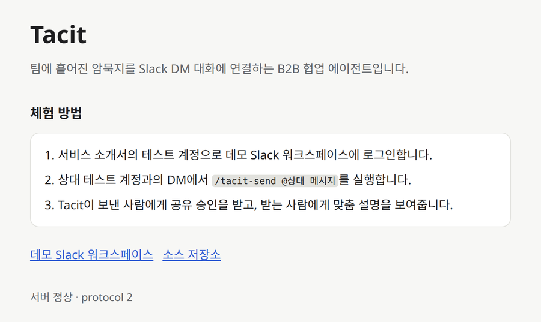

# Tacit

Slack DM에서 사람이 말하지 않은 배경을 각자의 AI 에이전트가 찾아 이어주는 B2B 협업 도구입니다.

팀장이 "최종본 확인해서 수정해줘요"라고 보낼 때, 팀장은 어제 공유 드라이브에 올린 v3를 떠올리지만 드라이브 권한이 없는 사원은 메일로 받은 v2를 엽니다. 같은 "최종본"인데 가리키는 파일이 다릅니다. Tacit은 보내는 사람의 자료에서 이 배경을 찾아 본인에게 확인을 받은 뒤 전달합니다. 받는 사람의 에이전트는 그 배경을 자기 자료와 비교해 어디가 다른지 알려줍니다.

## 체험하기

설치할 것은 없습니다. 브라우저만 있으면 됩니다.



1. [데모 워크스페이스 로그인 페이지](https://tacitdemo.slack.com/sign_in_with_password)에서 서비스 소개서의 테스트 계정 두 개로 각각 로그인합니다. Google·Apple 버튼이 아니라 아래쪽 이메일·비밀번호 칸을 사용합니다. 한 계정은 일반 창, 다른 계정은 시크릿 창에서 열면 두 사람의 화면을 나란히 볼 수 있습니다.
   - 연구팀장 A: 메시지를 보내는 쪽
   - 연구원 B: 메시지를 받는 쪽
2. 서버 상태는 [데모 안내 페이지](https://tacit-52-78-230-157.sslip.io/) 아래쪽에서 확인할 수 있습니다.

### 1단계. 메시지 보내기 (연구팀장 A)

연구원 B와의 DM을 열고 입력창에 다음을 입력합니다.

```
/tacit-send @연구원 B 최종본 확인해서 수정해줘요
```

`/tacit-send`만 입력하면 받는 사람과 메시지를 고르는 입력 창이 열립니다.

### 2단계. 공유할 배경 확인 (연구팀장 A)

원래 메시지는 A의 이름으로 DM에 바로 올라갑니다. 바로 아래에 A에게만 보이는 "공유할 내용"이 나타납니다. A의 에이전트가 A의 자료에서 찾은 배경입니다.


- **공유**: 이 배경을 상대 에이전트에게 전달합니다.
- **수정**: 문장을 고친 뒤 전달합니다.
- **공유 안 함**: 원래 메시지만 남기고 끝냅니다.

누르기 전까지 이 초안은 중계 서버에 올라가지 않습니다.

### 3단계. 맞춤 설명 받기 (연구원 B)

B의 창에서 같은 DM을 엽니다. B의 에이전트가 A가 공유한 배경과 B의 자료를 비교해, 다음 둘 중 하나를 B에게만 보여줍니다.


- **확인 질문**: 판단하기에 정보가 모자라면 한 가지를 묻습니다. "답변하기"를 눌러 답하면 그 답을 반영해 다시 설명합니다.
- **나를 위한 설명**: A가 말한 것과 B가 가진 자료의 차이, 그리고 다음에 할 일을 짧게 알려줍니다. 예를 들면 "팀장님이 말한 최종본은 v3(39,000원)인데 가지고 계신 건 v2(49,000원)예요. 드라이브 권한부터 확인하세요." 같은 식입니다.

역할을 바꿔서 연구원 B가 보내고 연구팀장 A가 받아도 똑같이 동작합니다.

### 다른 메시지로 해보기

메시지는 자유롭게 써도 됩니다. 데모 자료에는 아래 세 가지 상황이 들어 있고, 두 사람의 기록이 일부러 어긋나 있습니다.

| 상황 | 연구팀장 A의 자료 | 연구원 B의 자료 | 보낼 메시지 |
|---|---|---|---|
| 문서 버전 | 최종본은 드라이브의 v3(월 39,000원) | 메일로 받은 v2(월 49,000원), 드라이브 권한 없음 | 최종본 확인해서 수정해줘요 |
| 회의 시간 | 내일 ○○전자 미팅이 14:00로 당겨짐 | 메모에는 15:00, 14:00에는 다른 통화 | 내일 그 시간에 봐요 |
| 마감일 | 고객이 견적서를 이번 주 금요일(10/2)까지 요청 | 다음 주 금요일(10/9)로 알고 있음 | 견적서 마감 금요일이 이번 주예요? |

세 번째 상황은 연구원 B가 보내면 좋습니다. `/tacit-send`만 입력하고, 입력 창의 전송 방식에서 **Agent끼리 질문**을 고르면 팀장에게 원문 DM을 보내지 않고 팀장의 에이전트에게만 묻습니다. 팀장의 에이전트가 답을 만들면 팀장이 승인한 뒤 B에게 답이 돌아옵니다.

자료 원문은 [deploy/demo-workspaces](deploy/demo-workspaces)에 있습니다. 에이전트는 이 자료와 함께 두 사람의 최근 DM 대화도 근거로 읽습니다.

### 알아두면 좋은 점

- "나에게만 표시" 메시지는 Slack 특성상 새로고침하면 사라집니다. 받은 설명은 `/tacit-receive`로 다시 볼 수 있습니다.
- 에이전트가 자료를 읽고 답을 만드는 데 몇 초에서 수십 초가 걸립니다.
- 앱 목록의 **Tacit**을 누르면 나오는 홈 탭에서 "대화 기록 참고", "승인 없이 자동 공유" 같은 설정을 바꿀 수 있습니다.

## 전체 흐름

메시지를 보내는 방식은 세 가지입니다. 사람 사이의 DM, 상대 에이전트에게만 묻기, 모든 에이전트에게 묻기(`@broadcast`)입니다. 어느 방식이든 공유 전에 보내는 사람의 확인을 거칩니다. 받는 쪽 에이전트는 정보가 모자라면 최대 두 번까지 상대 에이전트에게 되묻고, 그래도 부족하면 자기 사용자에게 묻습니다.


## 개인정보를 다루는 방식

- 각 에이전트는 자기 사용자에게 허락된 폴더만 읽습니다.
- 보내는 사람이 승인하기 전의 초안은 중계 서버에 올리지 않고, 확인용 해시값만 보냅니다.
- 받는 쪽 에이전트가 상대에게 되묻는 질문에는 원래 메시지와 이미 공유된 내용만 들어갑니다. 받는 사람의 자료 내용은 질문에 넣지 않습니다.
- 사람 사이의 원래 DM은 그대로 두고, Tacit의 안내는 해당 사용자에게만 보입니다.

## 구성

```
Slack 데모 워크스페이스
      │  Socket Mode
┌─────┴──────────────── AWS EC2 (서울) ─────────────────┐
│  Slack 커넥터 ── relay(중계, 상태 저장) ── Caddy(HTTPS)   │
│                     │                                 │
│          worker A ──┴── worker B                      │
│      (A의 자료만 읽음)   (B의 자료만 읽음)                  │
└──────────────┬────────────────────────────────────────┘
               │ 인스턴스 역할(키 파일 없음)
          Amazon Bedrock
```

데모 서버는 심사용으로 두 사람의 worker를 한 서버에서 돌립니다. 실제 팀에 도입할 때는 worker를 각자의 PC에서 실행하고, 자기 자료 폴더와 개인 구독(Codex, Kiro, OpenCode)을 씁니다.

## 더 보기

- [데모 서버 배포 방법](deploy/README.md)
- [직접 설치·개발 안내](docs/DEVELOPER_GUIDE.md)
- [v2 작업 흐름](docs/WORKFLOW_V2.md), [프로토콜](docs/PROTOCOL.md)
