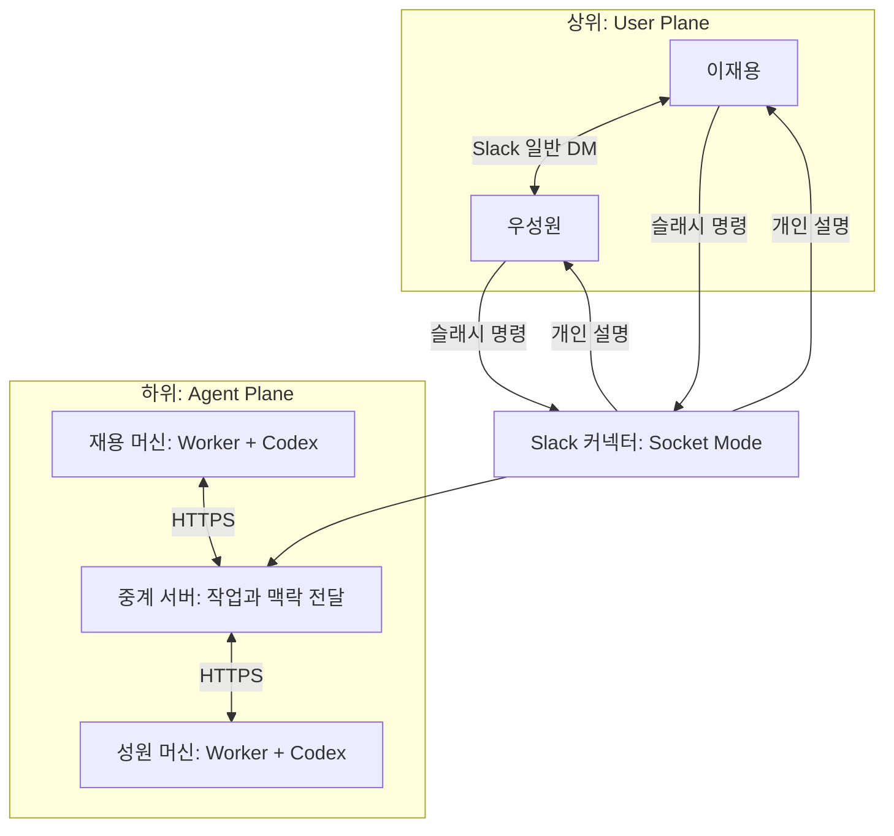

# Tacit Agent Plane

첫 마일스톤: 이재용과 우성원이 실제 Slack DM을 주고받을 때 각자의 머신에서 실행되는 Agent가 로컬 맥락을 찾아 교환하고, 수신자에게 맞춘 설명을 표시한다.

현재 구현은 **수동 명령 기반 첫 연결**이다. 실제 Slack 앱 설치와 두 머신의 접속 검증까지 마쳐야 첫 마일스톤이 완료된다. 모의 모델 테스트 통과를 실제 연결 성공으로 취급하지 않는다.

## 동작

1. Slack에서 `/tacit-send @상대 이번 결과 baseline이랑 비교해봤어?`를 입력한다.
2. Slack 커넥터가 즉시 명령을 접수하고 중계 서버에 작업을 등록한다.
3. 송신자의 로컬 실행기가 자신의 Slack 사용자 토큰으로 **본인 명의의 일반 DM**을 보낸다.
4. 로컬 실행기가 지정한 폴더의 텍스트를 읽고 Codex가 이를 바탕으로 맥락을 생성한다. DM의 채널 ID·메시지 시각과 맥락을 전용 HTTP 경로로 전달한다.
5. 수신자의 로컬 실행기도 자기 폴더를 읽고, Codex가 전달받은 맥락과 대조한다.
6. 수신자에게 Tacit 봇 DM으로 설명을 보낸다. `/tacit-receive [전달 ID]`로도 본인에게만 보이는 응답을 조회할 수 있다.

반대 방향도 동일하게 동작한다. 원문 DM의 실제 전송은 송신 실행기가 작업을 가져온 시점에 이루어지므로, 실행기가 꺼져 있으면 접수 후 대기한다.



중계 서버는 제품의 필수 전제가 아니다. 두 머신이 서로 접속할 수 있으면 직접 통신으로 바꿀 수 있다. 현재는 NAT·방화벽 환경에서 각 머신의 수신 포트를 열지 않고 연결하기 위해 사용한다. 각 실행기는 2초 간격으로 작업을 가져온다. 서버는 전달용 원문·맥락·결과를 SQLite에 보관하고, 파일 탐색과 추론은 각 머신에서 수행한다. 종단간 암호화는 아직 구현하지 않았다.

## 빠른 시작

Python 3.11 이상, `uv`, 로그인된 최신 Codex CLI가 필요하다. 이 구현은 CLI의 `--ignore-user-config`, `--ignore-rules`, `--ephemeral` 옵션을 사용한다. `codex exec --help`에서 지원 여부를 확인한다.

```bash
uv sync --locked
uv run pytest -q
```

두 사람의 설정을 한 번 생성한다. 토큰은 무작위로 생성되며 화면에 출력되지 않는다.

```bash
uv run python -m tacit.setup \
  --team T08TM41TK4P \
  --owner U09F4SENS3X \
  --peer U0ABNAMVB7U \
  --workspace /absolute/path/to/your/context
```

생성되는 `.tacit/setup/`는 Git에서 제외된다. 재실행하면 기존 설정을 덮어쓰지 않는다.

| 파일 | 사용 위치 | 채워야 할 값 |
|---|---|---|
| `relay.env` | 중계 서버 | 기본값으로 로컬 실행 가능 |
| `slack.env` | Slack 커넥터 한 개 | `SLACK_BOT_TOKEN`, `SLACK_APP_TOKEN` |
| `owner.env` | 재용 머신 | 본인의 `SLACK_USER_TOKEN`, 작업 폴더 |
| `peer.env` | 성원 머신 | 본인의 `SLACK_USER_TOKEN`, 작업 폴더, 중계 주소 |

성원에게는 `peer.env`만 별도의 안전한 경로로 전달한다. `relay.env`는 두 사용자의 인증 토큰을 포함한다. 각자 자신의 Codex 로그인과 Slack 사용자 토큰을 사용한다.

Slack 앱 생성부터 두 머신 연결까지는 [첫 연결 가이드](docs/FIRST_CONTACT.md)를 따른다.

## 실행 명령

중계 서버와 Slack 커넥터는 각각 하나만 실행한다. 아래는 **별도 터미널**에서 실행할 명령이다.

```bash
uv run tacit --env-file .tacit/setup/relay.env relay
uv run tacit --env-file .tacit/setup/slack.env slack
```

각 머신에서 자신의 설정으로 실행한다.

```bash
uv run tacit --env-file .tacit/setup/owner.env doctor
uv run tacit --env-file .tacit/setup/owner.env worker
```

성원 머신에서는 `owner.env` 대신 전달받은 `peer.env`를 사용한다. 각 머신의 `TACIT_WORKSPACE`에는 그 사용자의 실제 작업 맥락이 있는 폴더를 지정한다.

로컬 API 상태: `http://127.0.0.1:8765/health`. 개발용 API 문서: `http://127.0.0.1:8765/docs`.

## 협업 경계

| 담당 단위 | 코드 | 연결 계약 |
|---|---|---|
| Slack 입출력 | `tacit/slack.py`, `slack-manifest.json` | 명령 → exchange, 완료 결과 → 개인 DM |
| 로컬 Agent 실행 | `tacit/worker.py`, `tacit/provider.py` | 작업 폴더 + 메시지 → 맥락 또는 해석 |
| 머신 간 전달 | `tacit/relay.py`, `tacit/store.py` | 인증, 저장, 작업 할당, 처리 상태 |
| 통합 검증 | `tests/`, `docs/FIRST_CONTACT.md` | 양방향 흐름과 실제 두 사용자 연결 |

API 계약과 상태 전이는 [프로토콜 문서](docs/PROTOCOL.md)에 정리했다. 현재 저장소 코드에서 모델 연결은 Codex CLI 하나이며 Claude Code, API 직접 호출, Bedrock은 아직 연결하지 않았다. 사용자 지정 Codex 설정은 불러오지 않고 CLI 기본 모델을 사용한다. `TACIT_MODEL`로 모델을 명시할 수 있다.

## 현재 범위

- 지정 폴더의 로컬 텍스트를 메시지 발생 시 수집한다. 숨김 폴더·심볼릭 링크·대표적인 인증 파일을 제외하고 최대 32개 파일, 파일당 8,000자, 총 64,000자를 전달한다. 파일 선택은 경로 순서이며 의미 기반 검색은 아직 없다. 대화 기록·클라우드 자료의 자동 수집과 지속적 암묵지 갱신은 후속 범위다. 필요한 기록은 현재 폴더에 준비할 수 있다.
- 일반 DM 자동 감지, `@broadcast`, Agent끼리만 질의하는 Case 2는 아직 없다.
- 재시작 후 대기 작업은 SQLite에서 유지된다. 모델 실행 중 프로세스가 종료되면 10분의 작업 임대 시간이 만료된 뒤 재할당한다. 로컬 캐시가 있으면 원문 전송·모델 호출을 반복하지 않는다.
- Slack 전송과 로컬/서버 기록 사이의 장애에서는 중복 메시지가 생길 수 있다. 현재 전달은 exactly-once를 보장하지 않는다. 중계 서버와 Slack 커넥터는 각각 단일 프로세스로 실행한다.
- Codex에는 실행기가 수집한 텍스트와 도구를 호출하지 말라는 지시를 전달하며 읽기 전용 sandbox를 유지한다. 이 환경에서는 CLI 내부 파일 명령이 sandbox 오류로 실패하여 파일 수집을 Python 실행기에 두었다. 작업 폴더 밖 읽기를 운영체제 수준에서 차단하는 별도 격리는 아직 없다. 초기 실사용에서는 이번 소통에 사용할 자료가 있는 폴더를 지정한다.
- 서버와 로컬 캐시에 원문·맥락·해석이 저장되며 자동 삭제 정책은 아직 없다. 수신자의 해석은 송신 Agent에게 반환하지 않지만 중계 운영자는 저장된 결과에 접근할 수 있다.

구현 근거: [Slack Socket Mode](https://docs.slack.dev/tools/bolt-python/concepts/socket-mode/), [슬래시 명령](https://docs.slack.dev/tools/bolt-python/concepts/commands/), [사용자 메시지 전송](https://docs.slack.dev/reference/methods/chat.postMessage/), [OpenAI 공식 비대화형 Codex 문서](https://developers.openai.com/codex/noninteractive/).
