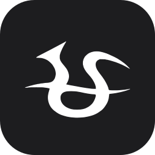
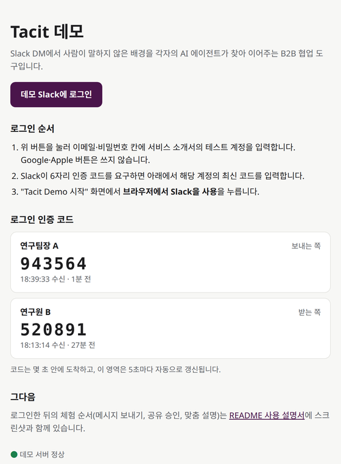
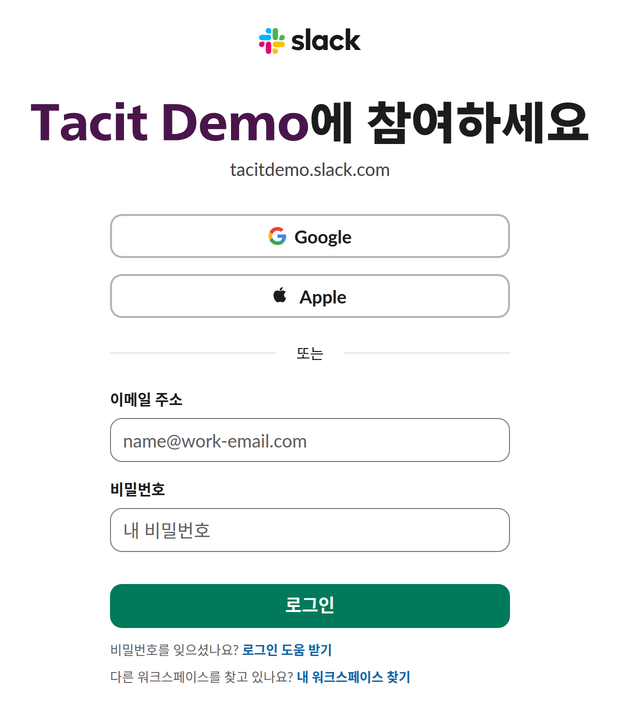
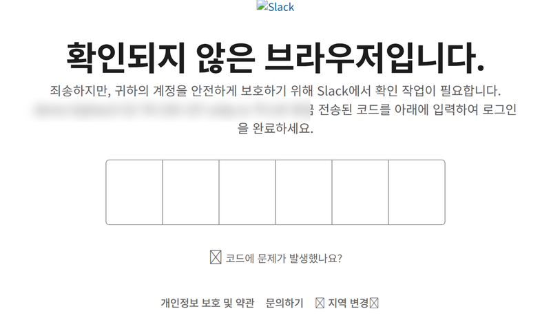
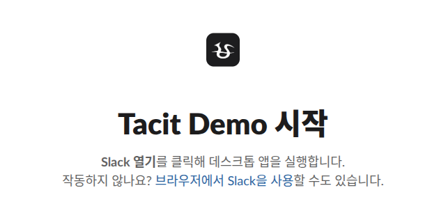
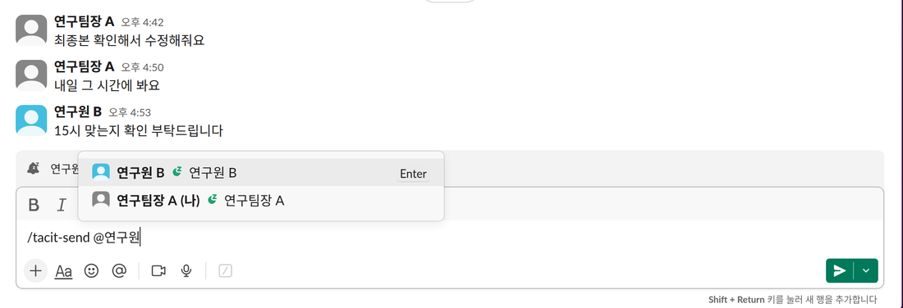
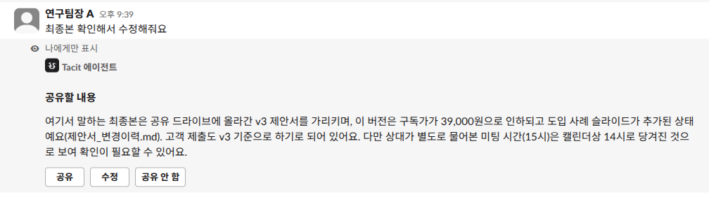
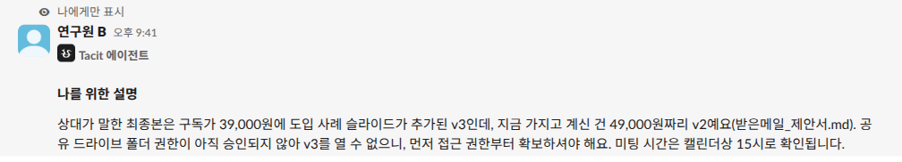
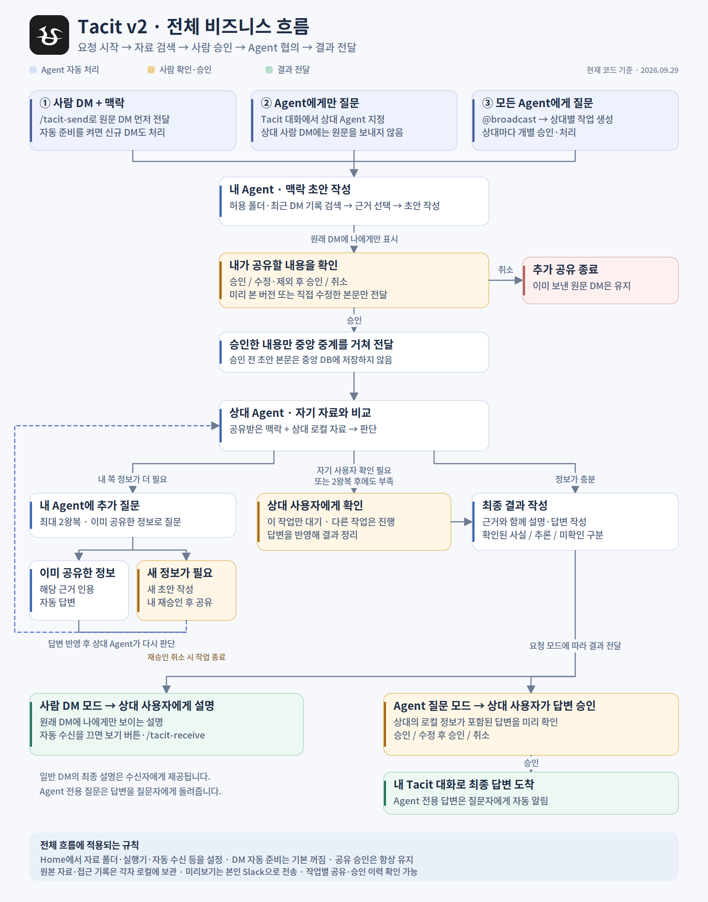
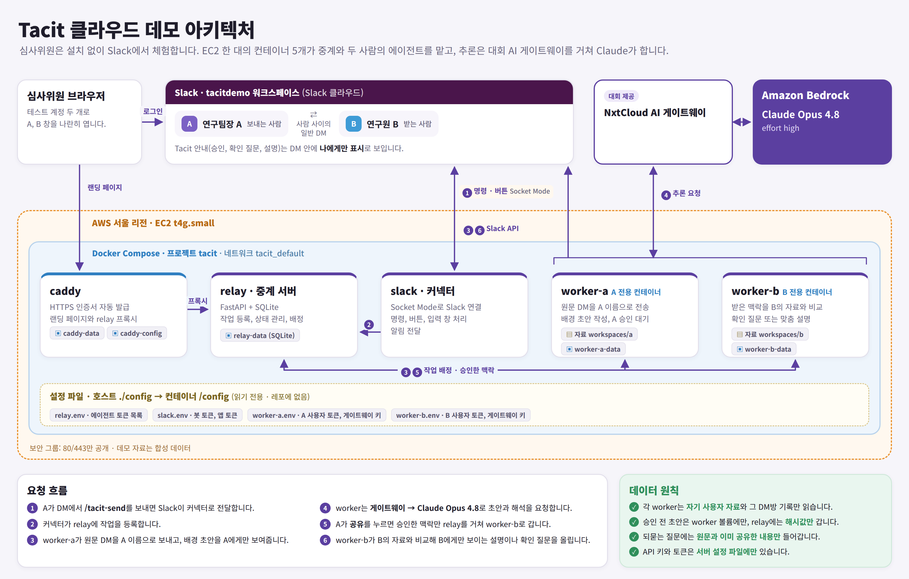

# Tacit

Slack DM에서 사람이 말하지 않은 배경을 각자의 AI 에이전트가 찾아 이어주는 B2B 협업 도구입니다.

팀장이 "최종본 확인해서 수정해줘요"라고 보낼 때, 팀장은 어제 공유 드라이브에 올린 v3를 떠올리지만 드라이브 권한이 없는 사원은 메일로 받은 v2를 엽니다. 같은 "최종본"인데 가리키는 파일이 다릅니다. 이런 어긋남은 보통 몇 번 되묻거나, 잘못된 파일로 일을 끝낸 뒤에야 드러납니다.

Tacit은 이 어긋남을 메시지를 주고받는 순간에 잡습니다.

1. 보내는 사람의 에이전트가 자기 자료에서 메시지의 배경(어떤 파일, 어떤 기준인지)을 찾아 초안을 만듭니다.
2. 보내는 사람이 그 초안을 확인하고 승인한 것만 상대에게 전달됩니다.
3. 받는 사람의 에이전트가 전달받은 배경을 자기 자료와 비교해 무엇이 다른지, 다음에 무엇을 하면 되는지 받는 사람에게만 알려줍니다.

사람 사이의 원래 DM은 그대로 두고, 에이전트의 안내는 각자에게만 보입니다.

## 체험하기

설치할 것은 없습니다. Chrome 같은 브라우저만 있으면 됩니다. 처음부터 결과를 보기까지 5분쯤 걸립니다.

**테스트 계정**: 연구팀장 A(보내는 쪽)와 연구원 B(받는 쪽) 두 개입니다. 이메일과 비밀번호는 서비스 소개서에 있습니다.

**[데모 안내 페이지](https://tacit-52-78-230-157.sslip.io/)**: 로그인 버튼과 실시간 인증 코드가 한 화면에 있습니다. 로그인하는 동안 이 페이지를 열어두세요.



한 사람이 두 계정으로 보내는 쪽과 받는 쪽을 나란히 보면서 진행합니다.

### 1. 창 두 개 열기

왼쪽에 일반 Chrome 창, 오른쪽에 시크릿 창(Windows `Ctrl+Shift+N`, macOS `⌘+Shift+N`)을 띄웁니다. 두 창을 모두 시크릿으로 열면 로그인이 서로 섞이니, 한쪽은 꼭 일반 창을 씁니다.

### 2. 로그인하기 (두 창에서 각각)

**① 비밀번호로 로그인합니다.** 두 창 모두 [데모 안내 페이지](https://tacit-52-78-230-157.sslip.io/)의 **데모 Slack에 로그인** 버튼(또는 [로그인 페이지](https://tacitdemo.slack.com/sign_in_with_password))을 엽니다. 한 창에는 연구팀장 A, 다른 창에는 연구원 B 계정을 입력합니다. Google·Apple 버튼이 아니라 아래쪽 이메일·비밀번호 칸을 씁니다.



**② 인증 코드를 요구하면 데모 안내 페이지에서 확인합니다.** 처음 쓰는 브라우저라면 Slack이 "확인되지 않은 브라우저입니다"라며 6자리 코드를 요구합니다. 이 코드는 메일함을 열 필요 없이 [데모 안내 페이지](https://tacit-52-78-230-157.sslip.io/)의 "로그인 인증 코드"에 몇 초 안에 뜹니다. 로그인하려는 계정 칸의 가장 최근 코드를 입력하세요. 코드 영역은 5초마다 자동으로 갱신됩니다.

<table><tr>
<td></td>
<td></td>
</tr><tr>
<td align="center">Slack이 코드를 요구하는 화면</td>
<td align="center">데모 안내 페이지의 인증 코드</td>
</tr></table>

코드가 보이지 않으면 10초쯤 기다렸다가 다시 보세요. 코드는 몇 분 뒤 만료되니, 오래된 코드가 거부되면 Slack 화면의 "코드에 문제가 발생했나요?"로 새 코드를 받으면 됩니다.

**③ 브라우저에서 Slack을 엽니다.** "Tacit Demo 시작" 화면이 나오면 **브라우저에서 Slack을 사용**을 누릅니다. 데스크톱 앱을 설치할 필요는 없습니다.



### 3. 받는 쪽 화면 먼저 열어두기 (연구원 B)

연구원 B 창의 왼쪽 목록 "다이렉트 메시지"에서 **연구팀장 A**를 눌러 DM을 열어둡니다. Tacit의 안내는 "나에게만 표시" 메시지라서 화면이 열려 있을 때만 도착하고, 새로고침하면 사라집니다.

> **시작 전 확인:** 두 창이 **모두 로그인된 상태**여야 합니다. 한 창은 연구팀장 A, 다른 창은 연구원 B로 Slack이 열려 있고, 연구원 B 창에는 연구팀장 A와의 DM이 떠 있어야 합니다. 한쪽만 로그인한 채 보내면 받는 쪽 결과를 볼 수 없습니다.

### 4. 메시지 보내기 (연구팀장 A)

연구팀장 A 창에서 **연구원 B**와의 DM을 열고 입력창에 다음을 입력합니다.

```
/tacit-send @연구원 B 최종본 확인해서 수정해줘요
```

`@연구원`까지 치면 자동완성 목록이 뜹니다. 목록에서 **연구원 B**를 골라야 받는 사람으로 인식됩니다. 그다음 메시지를 마저 쓰고 Enter를 누릅니다.



`/tacit-send`만 입력하고 Enter를 누르면 받는 사람과 메시지를 고르는 입력 창이 열립니다. 이 방법이 더 편하다면 입력 창을 써도 됩니다.

### 5. 공유할 배경 확인하기 (연구팀장 A)

원래 메시지는 A의 이름으로 DM에 바로 올라갑니다. 20~40초 뒤 그 아래에 A에게만 보이는 **공유할 내용**이 나타납니다. A의 에이전트가 A의 자료에서 찾은 배경이고, 근거가 된 파일 이름도 함께 적혀 있습니다.

Tacit이 보내는 안내는 첫 줄에 **Tacit 에이전트** 표시가 붙습니다. Slack은 사람 사이의 DM에 앱이 글을 올리지 못하게 해서, 이 안내는 보낸 사람 칸에 자기 이름이 보입니다.



- **공유**: 이 배경을 상대 에이전트에게 전달합니다.
- **수정**: 문장을 고친 뒤 전달합니다.
- **공유 안 함**: 원래 메시지만 남기고 끝냅니다.

누르기 전까지 이 초안은 중계 서버에 올라가지 않습니다. 여기서는 **공유**를 누릅니다.

### 6. 맞춤 설명 받기 (연구원 B)

A가 공유를 누르고 20~40초 뒤, 미리 열어둔 연구원 B 창에 B에게만 보이는 결과가 나타납니다. B의 에이전트가 A가 공유한 배경과 B의 자료를 비교한 것입니다.



결과는 다음 둘 중 하나입니다.

- **나를 위한 설명**: A가 말한 것과 B가 가진 자료의 차이, 그리고 다음에 할 일을 짧게 알려줍니다. 위 화면에서는 팀장이 말한 최종본은 v3(39,000원)인데 B가 가진 건 v2(49,000원)이고, 드라이브 권한부터 확인하라고 안내합니다.
- **확인 질문**: 판단하기에 정보가 모자라면 B에게 한 가지를 묻습니다. "답변하기"를 눌러 답하면 그 답을 반영해 다시 설명합니다.

역할을 바꿔서 연구원 B가 보내고 연구팀장 A가 받아도 똑같이 동작합니다.

### 다른 메시지로 해보기

데모 자료에는 아래 세 가지 시나리오가 들어 있습니다. 시나리오마다 두 사람의 기록이 일부러 어긋나 있고, 표의 메시지를 4단계처럼 보내면 됩니다. 메시지는 자유롭게 바꿔 써도 됩니다.

| 시나리오 | 연구팀장 A의 자료 | 연구원 B의 자료 | 보낼 메시지 |
|---|---|---|---|
| 1. 문서 버전 | 최종본은 드라이브의 v3(월 39,000원) | 메일로 받은 v2(월 49,000원), 드라이브 권한 없음 | 최종본 확인해서 수정해줘요 |
| 2. 회의 시간 | 내일 ○○전자 미팅이 14:00로 당겨짐 | 메모에는 15:00, 14:00에는 다른 통화 | 내일 그 시간에 봐요 |
| 3. 견적서 마감일 | 고객이 견적서를 이번 주 금요일(10/2)까지 요청 | 다음 주 금요일(10/9)로 알고 있음 | 견적서 마감 금요일이 이번 주예요? |

시나리오 3은 연구원 B가 보냅니다. `/tacit-send`만 입력하고, 입력 창의 전송 방식에서 **Agent끼리 질문**을 고르면 팀장에게 원문 DM을 보내지 않고 팀장의 에이전트에게만 묻습니다. 팀장의 에이전트가 답을 만들면 팀장이 승인한 뒤 B에게 답이 돌아옵니다.

자료 원문은 [deploy/demo-workspaces](deploy/demo-workspaces)에 있습니다. 에이전트는 이 자료와 함께 두 사람의 최근 DM 대화도 근거로 읽습니다.

### 막힐 때

| 증상 | 해결 방법 |
|---|---|
| 인증 코드를 요구함 | [데모 안내 페이지](https://tacit-52-78-230-157.sslip.io/)에서 해당 계정의 최신 코드를 입력합니다. |
| 데스크톱 앱을 열라고 함 | "브라우저에서 Slack을 사용"을 누릅니다. |
| 두 창이 같은 계정으로 바뀜 | 한 창은 일반 창, 다른 창은 시크릿 창으로 엽니다. |
| `@연구원 B`가 파란 멘션으로 바뀌지 않음 | 자동완성 목록에서 연구원 B를 직접 고릅니다. 또는 `/tacit-send`만 입력해 입력 창을 씁니다. |
| 1분이 지나도 아무것도 안 나타남 | [데모 안내 페이지](https://tacit-52-78-230-157.sslip.io/) 아래쪽에서 서버 상태를 확인합니다. |
| 새로고침해서 설명이 사라짐 | 그 DM에서 `/tacit-receive`를 입력하면 받은 설명을 다시 볼 수 있습니다. |

앱 목록의 **Tacit**을 누르면 나오는 홈 탭에서 "대화 기록 참고", "승인 없이 자동 공유" 같은 설정을 바꿀 수 있습니다.

## 전체 흐름

메시지를 보내는 방식은 세 가지입니다. 사람 사이의 DM, 상대 에이전트에게만 묻기, 모든 에이전트에게 묻기(`@broadcast`)입니다. 어느 방식이든 공유 전에 보내는 사람의 확인을 거칩니다. 받는 쪽 에이전트는 정보가 모자라면 최대 두 번까지 상대 에이전트에게 되묻고, 그래도 부족하면 자기 사용자에게 묻습니다.



## 개인정보를 다루는 방식

- 각 에이전트는 자기 사용자에게 허락된 폴더만 읽습니다.
- 보내는 사람이 승인하기 전의 초안은 중계 서버에 올리지 않고, 확인용 해시값만 보냅니다.
- 받는 쪽 에이전트가 상대에게 되묻는 질문에는 원래 메시지와 이미 공유된 내용만 들어갑니다. 받는 사람의 자료 내용은 질문에 넣지 않습니다.
- 사람 사이의 원래 DM은 그대로 두고, Tacit의 안내는 해당 사용자에게만 보입니다.

## 아키텍처



데모 서버는 심사용으로 두 사람의 worker를 한 서버에서 돌립니다. 실제 팀에 도입할 때는 worker를 각자의 PC에서 실행하고, 자기 자료 폴더와 개인 구독(Codex, Kiro, OpenCode)을 씁니다.

## 기술 구성

- Python 3.12, `uv`로 의존성 고정
- Slack Bolt(Socket Mode): 슬래시 명령, 버튼, 입력 창, "나에게만 표시" 메시지
- FastAPI + SQLite 중계 서버, httpx 기반 worker
- AI 추론: 대회 AI 게이트웨이(OpenAI 호환)를 거친 Amazon Bedrock Claude Opus 4.8
- 배포: AWS EC2의 Docker Compose, Caddy 자동 HTTPS

테스트는 `uv run pytest`로 실행합니다(150개). 승인 전 미전송, 수정본 고정, 최대 2번 되묻기, 권한과 대화 유형 판별 같은 흐름을 모의 Slack과 모의 worker로 확인합니다.

## 더 보기

- [데모 서버 배포 방법](deploy/README.md), [아키텍처 그림 PDF](docs/images/tacit-architecture.pdf)
- [직접 설치·개발 안내](docs/DEVELOPER_GUIDE.md)
- [v2 작업 흐름](docs/WORKFLOW_V2.md), [프로토콜](docs/PROTOCOL.md)
